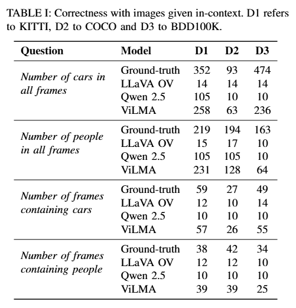
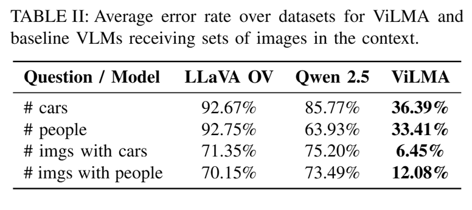
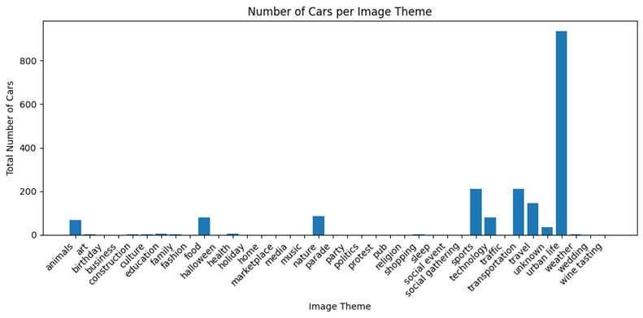
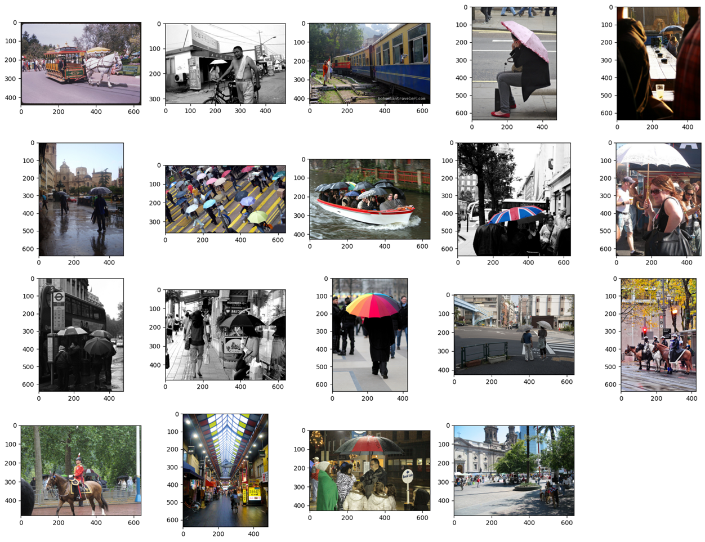

# ViLMA

This is the project repository containing supplementary materials for the paper _ViLMA: A System based on Vision Language Models for Meta-Analyses in Large Image Databases_ .

## Prompt for Image Processing

**Prompt Structure:** All VLMs received the same prompts as input, each of them containing the image, the question and instructions about the expected format of answers.
- For boolean questions, answers should be *"yes"* or *"no"*.
- For numeric questions, the answer should be a single integer.
- For categorical questions, the valid categories are given in the prompt along with an instruction to answer only the category name and nothing else.

**Examples of questions:**
- **boolean:** Is there a boat in the image? Respond only with one of the following options: 'yes', 'no'
- **boolean:**  Is there a bench in the image? Respond only with - - **numerical:** How many cars are in the image? Respond only with a single integer
- **numerical:**  How many people are in the image? Respond only with a single integer
- **categorical:** What time of day is depicted in the image? Respond only with one of the following options: 'unknown', 'day', 'night'
- **categorical:** What is the predominant theme of the image? Respond only with one of the following options: 'unknown', 'health', 'sports', 'nature', 'technology', 'food', 'education', 'culture', 'urban life', 'animals', 'fashion', 'family', 'travel', 'business', 'home', 'media'

**Postprocessing:** The question type also govern how outputs are filtered.
- For boolean and categorical questions, the system first checks for exact matches to one of the expected answers. If none is found, it checks if the answer starts with one the valid answers. If not, the answer is set as invalid.
- For numeric questions, we first try to convert the answer to the integer type directly. In case of error, the system verifies if the number has been textually written (e.g., *"three"* or *"twenty two"*) and attempts to transform it into a sequence of digits before converting the type. In case of failure the answer is also set as invalid.


## Raw Results for the Evaluation of End-to-End Models

This experiment evaluates if current VLMs can perform computation in multiple images in an end-to-end fashion. A subset of 64 images from each dataset are used simultaneously as input for the models. The small number of images is due to GPU memory constraints and to respect the context-length limits of all VLMs. The models used in analyses are LLaVA OV and Qwen 2.5 since LLaVA 1.6 was not trained in long sequences of images and Intern 2.5 presented the same behavior as LLaVA OV.  Results using ViLMA are also provided for comparison. The following table presents the absolute counts returned by the models.



The average error rate in relation to the ground-truth is given next. The error rate is computed by $|pred - gt| / |gt|$ and the average is over datasets.




## Script Generator - Prompts and Responses

The `Script Generator` module receives a prompt with a brief description of the tabular representation, the task and a list of  columns currently in the table. The task is placeholder filled with the user query. The column descriptions contain their indices and associated questions.

```
Consider a numpy array in which rows are images and columns store, for each image, answers for the following questions. The index indicate the column in which the answers to the question are stored. Generate python code to {task}. Return only the code without further textual explanations or justifications.

index 0: image path
index 1: Is there a person in the image? Respond only with one of the following options: 'yes', 'no'
index 2: Is there a car in the image? Respond only with one of the following options: 'yes', 'no'
(...)
index 30: What is the predominant theme of the image? Respond only with one of the following options: 'unknown', 'health', 'sports', 'nature', 'technology', 'food', 'education', 'culture', 'urban life', 'animals', 'fashion', 'family', 'travel', 'business', 'home', 'media'
```

A LLM (Chatgpt 5.5 in the present work) receives the prompt and generates python code to solve the task. The code is executed and the output is returned to the user.

### Example: Histogram with the number of cars per image theme

The following is a prompt asking for a histogram showing the number of cars per image theme.

```
Consider a numpy array in which rows are images and columns store, for each image, answers for the following questions. The index indicate the column in which the answers to the question are stored. Generate python code to plot a histogram showing the number of cars per image theme. Return only the code without further textual explanations or justifications.

index 0: image path
index 1: Is there a person in the image? Respond only with one of the following options: 'yes', 'no'
index 2: Is there a car in the image? Respond only with one of the following options: 'yes', 'no'
index 3: Is there a chair in the image? Respond only with one of the following options: 'yes', 'no'
index 4: Is there a book in the image? Respond only with one of the following options: 'yes', 'no'
index 5: Is there a bottle in the image? Respond only with one of the following options: 'yes', 'no'
index 6: Is there a cup in the image? Respond only with one of the following options: 'yes', 'no'
index 7: Is there a dining table in the image? Respond only with one of the following options: 'yes', 'no'
index 8: Is there a traffic light in the image? Respond only with one of the following options: 'yes', 'no'
index 9: Is there a handbag in the image? Respond only with one of the following options: 'yes', 'no'
index 10: Is there a bird in the image? Respond only with one of the following options: 'yes', 'no'
index 11: Is there a boat in the image? Respond only with one of the following options: 'yes', 'no'
index 12: Is there a bench in the image? Respond only with one of the following options: 'yes', 'no'
index 13: Is there an umbrella in the image? Respond only with one of the following options: 'yes', 'no'
index 14: Is there a cow in the image? Respond only with one of the following options: 'yes', 'no'
index 15: Is there a banana in the image? Respond only with one of the following options: 'yes', 'no'
index 16: Is there a carrot in the image? Respond only with one of the following options: 'yes', 'no'
index 17: Is there a kite in the image? Respond only with one of the following options: 'yes', 'no'
index 18: Is there a tv in the image? Respond only with one of the following options: 'yes', 'no'
index 19: Is there a remote in the image? Respond only with one of the following options: 'yes', 'no'
index 20: Is there a vase in the image? Respond only with one of the following options: 'yes', 'no'
index 21: Is there a surfboard in the image? Respond only with one of the following options: 'yes', 'no'
index 22: Is there a sink in the image? Respond only with one of the following options: 'yes', 'no'
index 23: Is there an oven in the image? Respond only with one of the following options: 'yes', 'no'
index 24: How many cars are in the image? Respond only with a single integer
index 25: How many people are in the image? Respond only with a single integer
index 26: What is the predominant color of the image? Respond only with one of the following options: 'red', 'yellow', 'blue', 'orange', 'purple', 'green', 'white', 'gray', 'black'
index 27: What is the quantity of cars in the image? Respond only with one of the following options: 'none', 'few', 'many'
index 28: What time of day is depicted in the image? Respond only with one of the following options: 'unknown', 'day', 'night'
index 29: What is the predominant environment in the image? Respond only with one of the following options: 'unknown', 'indoor', 'outdoor'
index 30: What is the predominant theme of the image? Respond only with one of the following options: 'unknown', 'health', 'sports', 'nature', 'technology', 'food', 'education', 'culture', 'urban life', 'animals', 'fashion', 'family', 'travel', 'business', 'home', 'media'
```

The code generated by the LLM is presented below.

```python
import numpy as np
import matplotlib.pyplot as plt
from collections import defaultdict

# Column indices
THEME_COL = 30
NUM_CARS_COL = 24

# Accumulate total number of cars per theme
cars_per_theme = defaultdict(int)

for row in data:
    theme = row[THEME_COL].strip().lower()

    try:
        num_cars = int(row[NUM_CARS_COL])
    except (ValueError, TypeError):
        num_cars = 0

    cars_per_theme[theme] += num_cars

# Sort themes alphabetically
themes = sorted(cars_per_theme.keys())
counts = [cars_per_theme[t] for t in themes]

# Plot
plt.figure(figsize=(10, 5))
plt.bar(themes, counts)
plt.xlabel("Image Theme")
plt.ylabel("Total Number of Cars")
plt.title("Number of Cars per Image Theme")
plt.xticks(rotation=45, ha="right")
plt.tight_layout()
plt.show()
```

When executed, the code produces the following image.



### Example: Image Retrieval

In this example, the `Script Generator` is asked to find images with more than 3 people, travelling or in urban life, and with the presence of an umbrella.

The returned code is given below:

```python
import numpy as np

mask = (
    # What is the predominant theme of the image?
    np.isin(data[:, 30], ["urban life", "travel"]) &
    # How many people are in the image?
    (data[:, 25].astype(int) > 3) &
    # Is there an umbrella in the image?
    (data[:, 13] == True)
)

image_paths = data[mask, 0]
print(len(image_paths))
```

Examples of images returned by the code are presented next.



